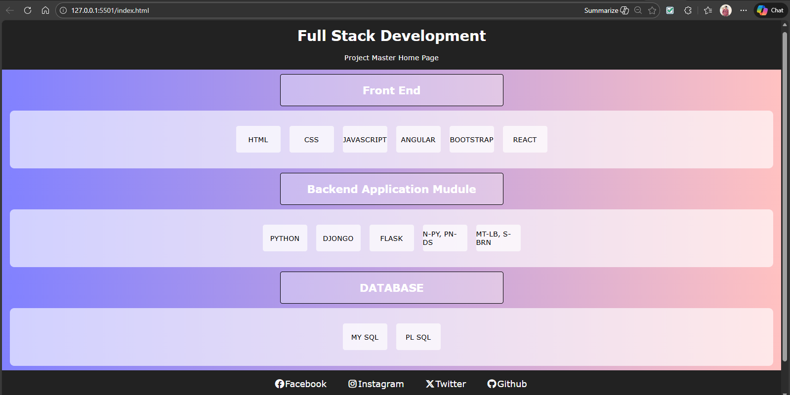
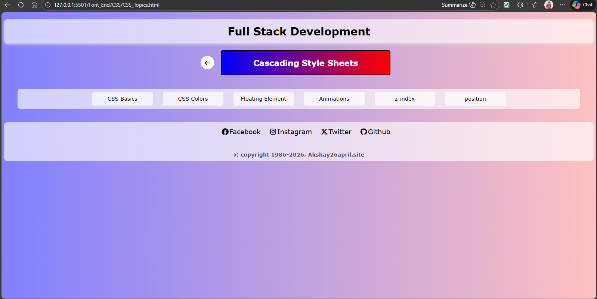
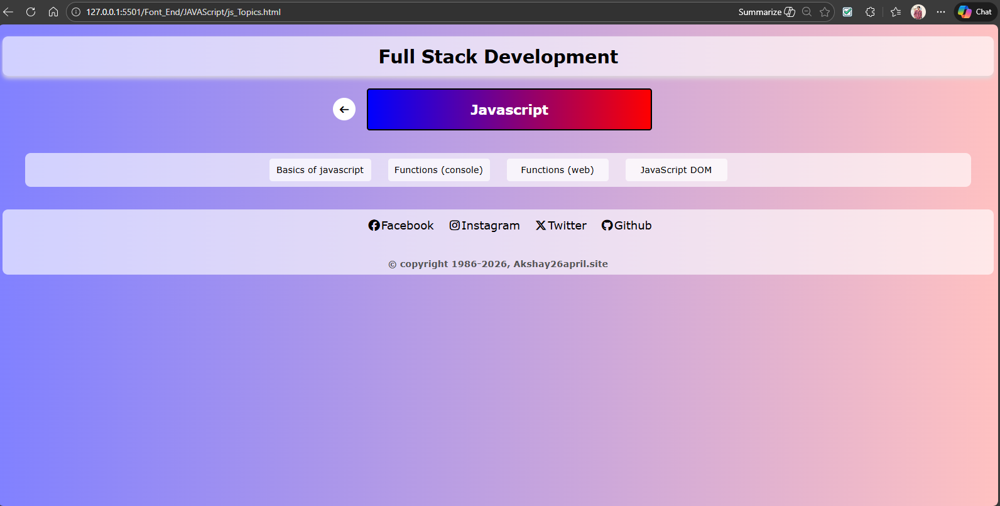

# 🚀 Full_Stack_Developer

## 📘 First Page Of Tutorial

This repository contains a **complete Full Stack Development tutorial** with  
**real-world implemented practicals**.  
All concepts are demonstrated using **working web pages**, so learners can
**see, run, and understand** each feature practically.

---> 📌**Note** All topics Updated Soon...

## 🧑‍💻 What This Tutorial Covers

- 🌐 Frontend Development (HTML, CSS, JavaScript)
- ⚙️ Backend Development
- 🔗 API Integration
- 🗄️ Database Connectivity
- 📱 Responsive Web Pages
- 🧠 Logic Building with Practical Examples
- 🚀 Real-time Implementation on Web Pages

Each topic is implemented and displayed directly on the browser.
> 📌 **Note** All topics Updated Soon...

---

## 🖼️ Project Screenshots (Internal Images)

Below are screenshots from the actual implementations:

### 🔹 Tutorial Home Page

### 🔹 Output HTML Page

### 🔹 Output CSS Page

### 🔹 Output Javascript Page

> 📌 **Note:** All images are stored inside the repository.
> 📌 **Note** All topics Updated Soon...
